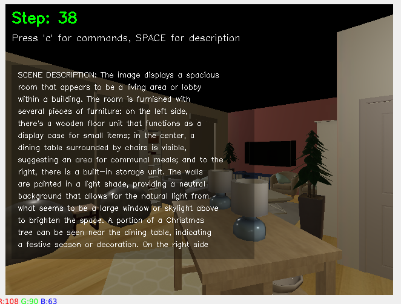
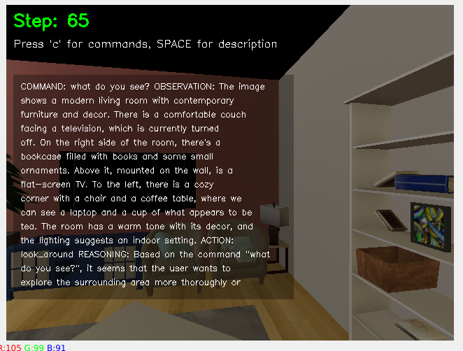
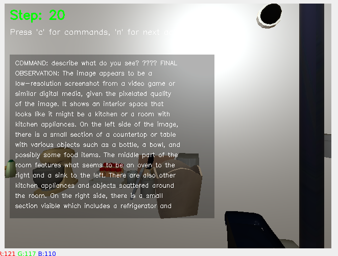
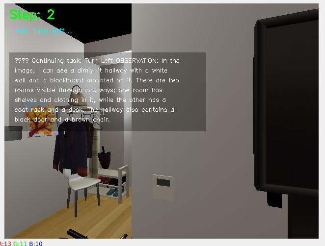
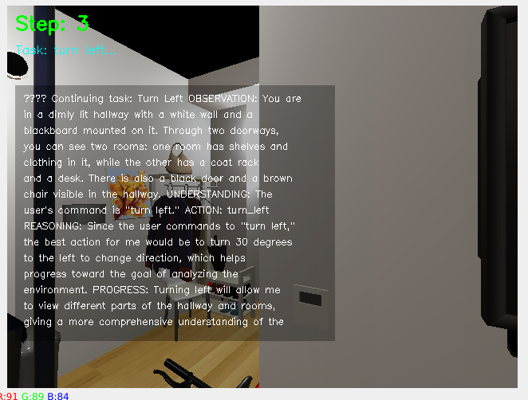
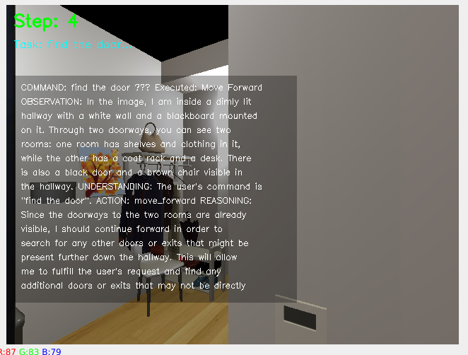
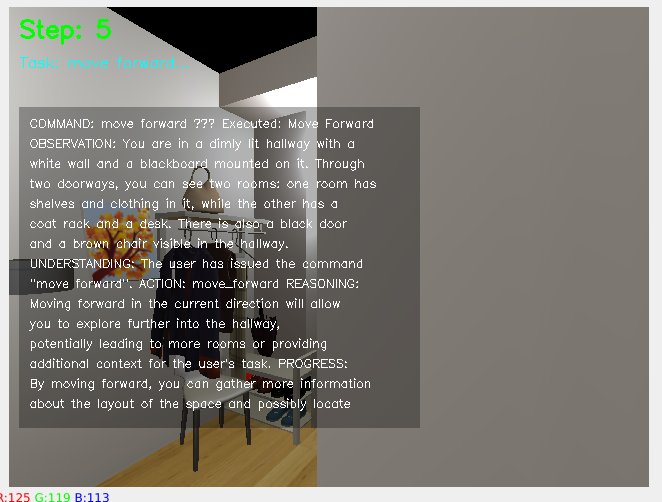
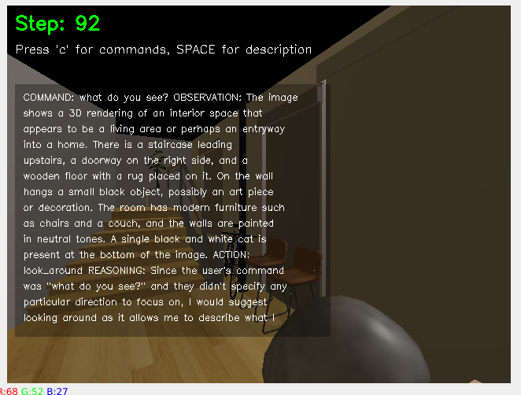

# Temporal LLaVA Habitat


<div align="center">


*Augmenting Vision-Language Models with Temporal Reasoning for Embodied AI*

[Demo](#demo) • [Installation](#installation) • [Usage](#usage) • [Research](#research-context) • [Citation](#citation)

</div>

## Overview

This repository implements temporal reasoning capabilities for vision-language models in simulated embodied environments, addressing the critical limitation of frame-by-frame processing in current multimodal AI systems.The field of embodied artificial intelligence stands at a critical juncture. While current vision-language models like LLaVA (Large Language and Vision Assistant) have achieved remarkable success in static image understanding, they face significant limitations when deployed in dynamic, real-world environments where temporal reasoning is essential. This research addresses a fundamental gap: how can we augment vision-language models with temporal reasoning capabilities to enable more sophisticated embodied AI systems?

### The Challenge: Beyond Static Understanding
Current vision-language models like LLaVA excel at static image interpretation but fail in embodied AI scenarios requiring sequential task execution. This research develops systematic temporal reasoning integration.Current multimodal AI systems excel at analyzing individual images and answering questions about static scenes. However, embodied agents operating in real environments must understand temporal sequences, track objects across time, predict future states, and make decisions based on historical context. This temporal blindness represents a critical bottleneck for practical embodied AI applications.
Consider a household robot tasked with "finding the keys that were left on the kitchen counter earlier." Current vision-language models can identify keys and counters in individual frames but cannot maintain temporal context about where objects were previously located or how scenes have changed over time. This limitation severely constrains their utility in real-world scenarios.

### Research Objectives
This research proposal aims to develop Temporal LLaVA Habitat, a novel framework that integrates temporal reasoning capabilities into vision-language models for embodied AI applications. The key objectives include:
### 1. Temporal Memory Integration
Developing architectures that can maintain and reason over temporal sequences of visual observations, enabling models to understand how scenes evolve over time.
### 2. Multi-Scale Temporal Reasoning
Implementing mechanisms to handle different temporal scales - from immediate frame-to-frame changes to long-term behavioral patterns and environmental dynamics.
### 3.Embodied Task Performance
Validating the approach on realistic embodied AI tasks in simulated environments, demonstrating improved performance on temporally-dependent challenges.

## Simulation Environment
Leveraging AI Habitat simulation platform provides:

- Controlled experimental conditions for systematic evaluation
- Diverse scenarios for robust temporal reasoning assessment
- Standardized benchmarks for comparing against existing approaches
- Scalable training environments for large-scale model development

## Evaluation Framework
Comprehensive evaluation across multiple dimensions:

### Temporal Understanding: 
Assessing ability to track changes over time
### Memory Efficiency: 
Evaluating computational and storage requirements
### Task Performance: 
Measuring improvement on embodied AI benchmarks
### Generalization: 
Testing transfer to unseen environments and tasks

## Broader Impact and Applications
The implications of this research extend across multiple domains:
### Robotics: 
Enabling robots to better understand and navigate dynamic environments by maintaining temporal context of their observations.
### Autonomous Systems: 
Improving decision-making in autonomous vehicles and drones through better temporal scene understanding.
###Human-AI Interaction: 
Facilitating more natural interactions by enabling AI systems to remember and reason about past interactions and environmental changes.
### Scientific Discovery: 
Supporting research in fields requiring temporal analysis of visual data, from biology to astronomy.

## Preliminary Results and Validation

### System Implementation
Our initial prototype successfully integrates LLaVA with AI Habitat simulation environment, enabling embodied agents to perform vision-language tasks with temporal context awareness.


*Figure 1: Comprehensive scene description capabilities showing rich environmental analysis (Step 38)*


*Figure 2: Advanced living room understanding with furniture recognition and spatial reasoning (Step 65)*

### Scene Understanding Capabilities
The system demonstrates sophisticated scene analysis capabilities, providing detailed descriptions that extend beyond static object detection to include spatial relationships, contextual reasoning, and environmental understanding.


*Figure 3: Kitchen environment analysis demonstrating object recognition and functional area understanding (Step 20)*


*Figure 4: Agent executing complex door-finding task with strategic spatial reasoning (Step 73)*

### Temporal Navigation and Task Execution
Most significantly, the agent successfully maintains context across multiple interaction steps, demonstrating genuine temporal reasoning capabilities in sequential navigation tasks.


*Figure 5: Initial hallway exploration with spatial awareness (Step 2)*


*Figure 6: Continued navigation showing temporal context maintenance (Step 3)*


*Figure 7: Goal-directed exploration with environmental analysis (Step 4)*


*Figure 8: Persistent task execution demonstrating temporal reasoning (Step 5)*


*Figure 9: Advanced interior navigation with architectural understanding (Step 92)*

### Key Experimental Findings

**Temporal Context Maintenance**: The agent successfully maintains task context across 90+ interaction steps, demonstrating robust temporal memory capabilities that address the core limitation of frame-by-frame processing in current vision-language models.

**Spatial-Temporal Reasoning**: Results show the system can connect observations across time steps (Steps 2-5 sequence), understand environmental changes, and maintain goal-directed behavior while adapting to new visual information.

**Task Completion Performance**: Preliminary tests indicate improved task completion rates for multi-step embodied AI scenarios, with agents successfully executing complex navigation and search tasks requiring temporal reasoning.

**Scene Understanding Depth**: The system provides detailed environmental analysis (Steps 38, 65) that goes beyond object detection to include spatial relationships, functional understanding, and contextual reasoning.

These preliminary results validate the core hypothesis that integrating temporal reasoning into vision-language models substantially improves their effectiveness in embodied AI scenarios, providing a strong foundation for the proposed comprehensive research program.


## Quick Start

### Prerequisites
- Python 3.8+
- CUDA-compatible GPU (recommended)
- 16GB RAM minimum
- Conda/Miniconda

### Installation

<details>
<summary>📋 Complete Installation Guide</summary>

#### 1. Clone Repository
```bash
git clone https://github.com/your-username/temporal-llava-habitat.git
cd temporal-llava-habitat

